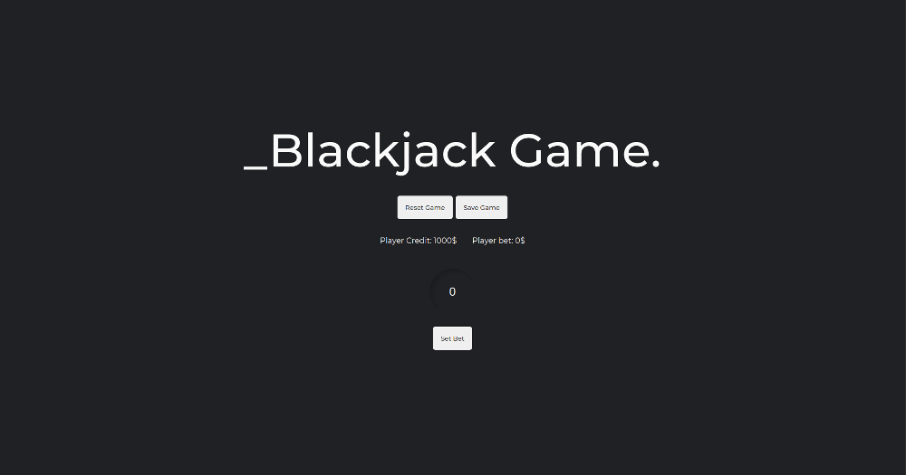
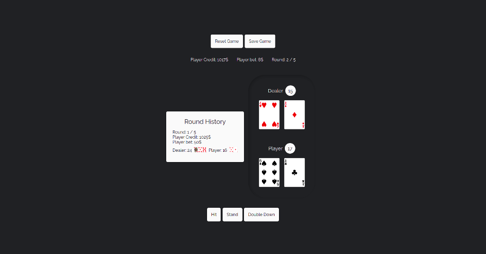
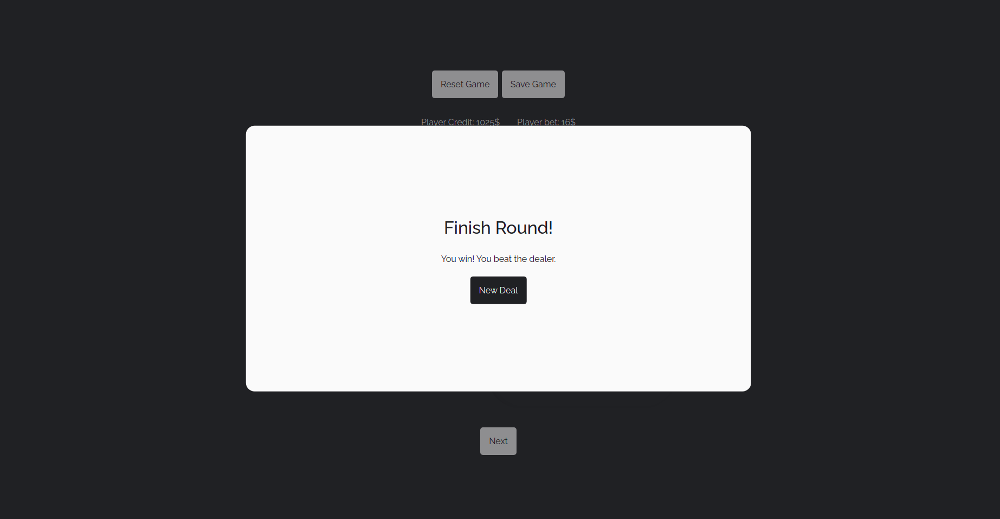

## Blackjack

Single page application built on the React.

## Description

The project is designed to demonstrate knowledge and practical skills about JavaScript framework React, React state management with Context API and React hook useReducer, collaborate with Deck of Cards using Axios, application style with the CSS preprocessor SASS (BEM).

### Demo

https://cocky-bhabha-2e8f6f.netlify.app

#### Screenshots of the app

### Technologies

Front-end (hosted by www.netlify.com)

- React
- SASS
- Axios

#### Backend

- Deck of Cards API

## Getting started

  App requires to have node (4.x.x) and npm (2.x.x) installed.

#### Start with installing the dependencies:

  Run `npm install` to install all required packages.

#### Running:

  Use `npm run dev` to start the dev server.
