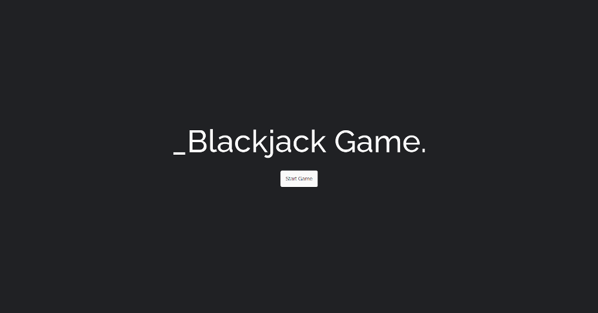

## Search books 

Single page application built on the React.

## Description

### Demo

#### Screenshots of the app

### Technologies

- React
- SASS
- Axios

#### Backend

- Deck of Cards

### Features

## Getting started

  App requires to have node (4.x.x) and npm (2.x.x) installed.

#### Start with installing the dependencies:

  Run `npm install` to install all required packages.

#### Running:

  Use `npm run dev` to start the dev server.
